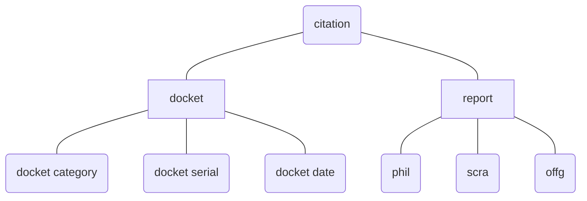

# Overview

!!! note "Overall strategy"

    Like [citation-reports](https://github.com/justmars/citation-report), there is a problem involving inconsistent use of values citations. We address it the same way by dissecting the component parts and generating a uniform citation.

The component parts of a Supreme Court decision citation:

Sample citation, typically found in the body and the footnotes section of a decision:

> Bagong Alyansang Makabayan v. Zamora, G.R. Nos. 138570, 138572, 138587, 138680, 138698, October 10, 2000, 342 SCRA 449

Dissecting the above yields

case title|docket category | docket serial | docket date | report phil | report scra | report offg
:--:|:--:|:--:|:--:|:--:|:--:|:--:
_Bagong Alyansang..._ | `gr` | 138570 | 2000-10-10 | - | 342 SCRA 449 | -

## Citation

The `Report` Model from [citation-report](https://github.com/justmars/citation-report) is only one part of a Philippine Supreme Court citation. This library will handle the patterns involved with respect to the [Docket][docket-model], for the purpose of creating a [Citation][citation].

::: citation_utils.Citation

## CountedCitation

::: citation_utils.CountedCitation
