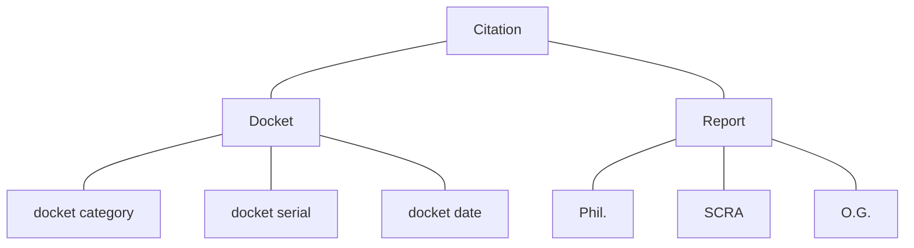

# citation-utils

`citation-utils` extracts Philippine Supreme Court citations with docket
information. It combines the docket grammar maintained here with the date and
report grammars from [citation-date](https://github.com/justmars/citation-date)
and [citation-report](https://github.com/justmars/citation-report).

The parser organizes citation evidence that appears in the source. It does not
infer a case title, a missing reporter, or a missing docket component; nor does
it authenticate or verify the source document. Keep the source text and its
location for legal review.

## Reader Paths

=== "Extract records"

    1. Read [Extracting citations](citeable.md) for `Citation` and
       `CitableDocument`.
    2. Use `Citation.extract_citations()` for a stream of normalized records.
    3. Use `CountedCitation.from_source()` when repeated mentions matter.

=== "Review evidence"

    1. Read [Extracting citations](citeable.md) for the parser's evidentiary
       limits and its treatment of repeated report references.
    2. Retain the original document, quotation, and location beside the
       normalized record.
    3. Treat OCR repairs as matching aids to verify against the source, not as
       proof of the correct docket number.

=== "Work with docket text"

    1. Read [Docket types](structure.md) for supported categories and their
       normalized fields.
    2. Keep the original source text as evidence.
    3. Use the database-oriented aliases (`cat`, `num`, and `date`) when
       serializing a citation.

=== "Develop locally"

    1. Read [Development](development.md) for the uv, Marimo, and documentation
       checks.
    2. Run `just check` before publishing a package change.

## Citation Components

The component parts of a Supreme Court decision citation are:


```mermaid
flowchart TB
cite["Citation"]---docket["Docket"]
cite---report
docket---d1["docket category"]
docket---d2["docket serial"]
docket---d3["docket date"]
report["Report"]---r1["Phil."]
report---r2["SCRA"]
report---r3["O.G."]
```

For example:

> Bagong Alyansang Makabayan v. Zamora, G.R. Nos. 138570, 138572, 138587, 138680, 138698, October 10, 2000, 342 SCRA 449

The first docket serial and the report become one normalized citation record.
That is useful for indexing; it does not replace the complete multi-number
source citation:

| Docket category | Docket serial | Docket date | Phil. | SCRA | O.G. |
| --- | --- | --- | --- | --- | --- |
| `gr` | `138570` | `2000-10-10` | — | `342 scra 449` | — |

## Quick Example

```python
from citation_utils import Citation

text = "G.R. No. 147033, April 30, 2003, 374 Phil. 1"
citation = Citation.extract_citation(text)

assert citation is not None
assert citation.set_slug() == "gr-147033-2003-04-30"
assert citation.phil == "374 Phil. 1"
```

The `Citation` model exposes database aliases through `model_dump()`:
`cat`, `num`, `date`, `phil`, `scra`, and `offg`. The same aliases can be used
to reconstruct a model from stored data.
