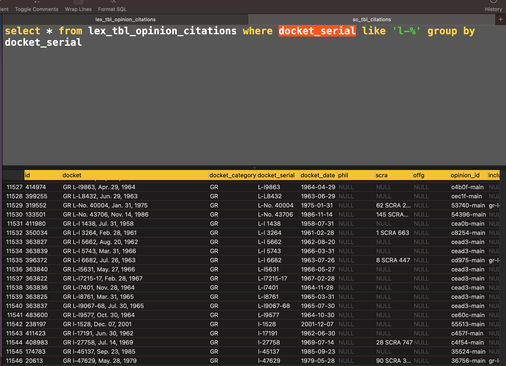

---
hide:
  - navigation
---
# Citation Docket

## The "Docket Report" Citation

Let's look at sample citation that is typically found in the body and the footnotes section of a decision:

> Bagong Alyansang Makabayan v. Zamora, G.R. Nos. 138570, 138572, 138587, 138680, 138698, October 10, 2000, 342 SCRA 449

We can separate the `Docket` portion from the `Report` portion:

Docket | Report
--:|:--
G.R. Nos. 138570, 138572, 138587, 138680, 138698, October 10, 2000 | 342 SCRA 449

For lack of a better term, we'll call the combination of a `Docket` and a `Report` a `DocketReportCitation`. It is implemented by:

:::citation_docket.regexes.models.docket_citation

## Docket Models

:::citation_docket.regexes.models.docket_model

### Docket Categories

:::citation_docket.regexes.models.docket_category

### Docket Construction

Although the docket models share a similar configuration, the regex strings involved are different for each, prompting the need for a preparatory constructor class:

:::citation_docket.regexes.models.constructor

#### GR

:::citation_docket.regexes.constructed_gr

##### Nuanced General Register ID Matching

*Note:* What is the value of adding `L-` to a General Register docket? It seems like L stands for "Legacy" although I can't seem to find official references to its designation.

:::citation_docket.regexes.models.gr_clean

#### AM

:::citation_docket.regexes.constructed_am

#### AC

:::citation_docket.regexes.constructed_ac

#### BM

:::citation_docket.regexes.constructed_bm
